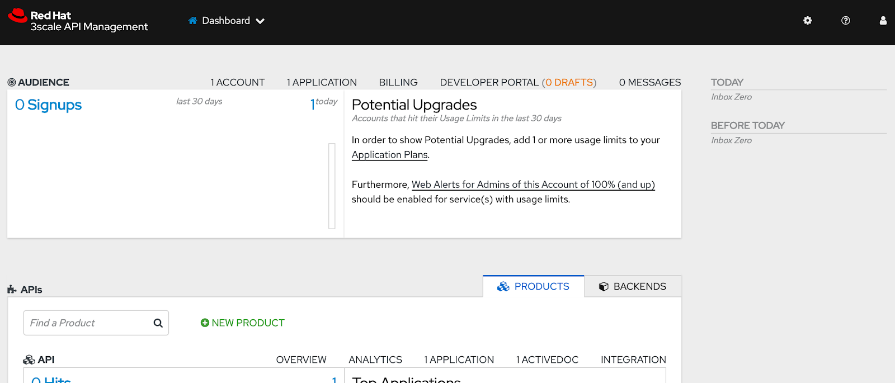

# Installing 3scale in OpenShift on IBM Cloud

The purpose of this repo is to provide sample instructions for installing 3scale in OpenShift on IBM Cloud.  It is meant to help you quickly prototype for demo purposes.  Read the official documentation and modify the setup as necessary for production.

## Prerequisites

* OpenShift on IBM Cloud v4.5.15
* Admin access to OpenShift
* Configure [Registry Service Accounts](https://access.redhat.com/RegistryAuthentication) in the cluster

## Prep

Login to the cluster using `oc login` and admin credentials.

Create a new project, for example:

```bash
oc new-project sample
```

Create a IBM file storage class with a custom GID:

```bash
oc create -f config/storageclass.yaml
```

## 3scale

We will deploy 3scale using the Operator.  The installation will include both the control plane (API Manager) and two API gateways (APIcast).  One gateway is called `staging` and the other gateway is called `production`.

Login to the cluster using the console and admin credentials.

Install the [Red Hat Integration - 3scale](https://catalog.redhat.com/software/operators/detail/5ef46a0e7dc79430ca5f4fd5) Operator.

* Version `threescale-2.9` was deployed at the time of this writing.
* Select the project you created earlier for the namespace to deploy (e.g. `sample`)

Modify the [APIManager](/config/apimanager.yaml) file.  Replace the `namespace` and `wildcardDomain`.

Then, deploy the APImanager:

```bash
oc create -f config/apimanager.yaml
```

Wait ~5 minutes.  Look at the pods in your project:

```bash
oc get pods
```

Output (sample):

```
NAME                               READY   STATUS      RESTARTS   AGE
3scale-operator-796d4bc585-vx8cl   1/1     Running     0          80m
apicast-production-1-deploy        0/1     Completed   0          71m
apicast-production-1-v6c2j         1/1     Running     0          71m
apicast-staging-1-7b7l4            1/1     Running     0          71m
apicast-staging-1-deploy           0/1     Completed   0          71m
backend-cron-1-deploy              0/1     Completed   0          72m
backend-cron-1-fx49n               1/1     Running     0          72m
backend-listener-1-deploy          0/1     Completed   0          72m
backend-listener-1-t6jd6           1/1     Running     0          72m
backend-redis-1-deploy             0/1     Completed   0          72m
backend-redis-1-gbbh5              1/1     Running     0          71m
backend-worker-1-564pt             1/1     Running     0          72m
backend-worker-1-deploy            0/1     Completed   0          72m
system-app-1-deploy                0/1     Completed   0          72m
system-app-1-hook-post             0/1     Completed   0          68m
system-app-1-hook-pre              0/1     Completed   3          72m
system-app-1-w8979                 3/3     Running     0          70m
system-memcache-1-deploy           0/1     Completed   0          72m
system-memcache-1-l2fm9            1/1     Running     0          72m
system-mysql-1-deploy              0/1     Completed   0          72m
system-mysql-1-kkqj6               1/1     Running     0          72m
system-redis-1-5lmnk               1/1     Running     0          71m
system-redis-1-deploy              0/1     Completed   0          72m
system-sidekiq-1-deploy            0/1     Completed   0          72m
system-sidekiq-1-zq7fh             1/1     Running     0          72m
system-sphinx-1-28287              1/1     Running     0          72m
system-sphinx-1-deploy             0/1     Completed   0          72m
zync-1-4wznb                       1/1     Running     0          72m
zync-1-deploy                      0/1     Completed   0          72m
zync-database-1-deploy             0/1     Completed   0          72m
zync-database-1-xpj5k              1/1     Running     0          72m
zync-que-1-bwnsw                   1/1     Running     2          72m
zync-que-1-deploy                  0/1     Completed   0          72m
```

Make sure the pods are in a `Running` state.  Get the route to 3scale console:

```bash
oc get route -l zync.3scale.net/route-to=system-provider
```

Get the admin user and password to 3scale console:

```bash
echo $(oc get secret system-seed -o jsonpath="{.data.ADMIN_USER}") | base64 --decode && echo
echo $(oc get secret system-seed -o jsonpath="{.data.ADMIN_PASSWORD}") | base64 --decode && echo
```

Login to 3scale using the credentials.  You should see the following:



## Troubleshooting

1. Registry Service Accounts

The cluster needs credentials to pull images from registry.redhat.io.  By default, the cluster does not have access to this registry.  If you ignore this step and try to deploy 3scale, the 3scale pods will not come up.  If you look at the imagestream of the container images using `oc describe`, you will see this error in the logs:

```
  ! error: Import failed (InternalError): Internal error occurred: registry.redhat.io/3scale-amp2/apicast-gateway-rhel8@sha256:59d53166fd14e52a5da46e215fbe731796accfd6b98efdbd093ee45604e8e0a9: Get https://registry.redhat.io/v2/3scale-amp2/apicast-gateway-rhel8/manifests/sha256:59d53166fd14e52a5da46e215fbe731796accfd6b98efdbd093ee45604e8e0a9: unauthorized: Please login to the Red Hat Registry using your Customer Portal credentials. Further instructions can be found here: https://access.redhat.com/RegistryAuthentication
```

2. Custom Storage Class

The `system` component of 3scale requires access to shared file storage with RWX access.  OpenShift on IBM Cloud offers a storage class with RWX access called `ibmc-file-bronze`.  However, only root containers can write to this file storage type.  In OpenShift, containers are disallowed from running as root by default.  To fix this issue, you must create a custom storage class in OpenShift on IBM Cloud with a GID that allows non-root containers to write to the file storage.

Finally, you must specify this custom storage class as the `fileStorage` type in 3scale API manager before deploying 3scale.

Read the IBM Cloud [documentation](https://cloud.ibm.com/docs/containers?topic=containers-cs_troubleshoot_storage#cs_storage_nonroot
) for a more detailed explanation of the issue.

3. Grafana

3scale will attempt to create Grafana dashboards if monitoring is not disabled in APIManager (i.e. `monitoring: false`).  You can check by looking at the 3scale operator logs:

```
{"level":"info","ts":1599674209.388439,"logger":"controller_apimanager","msg":"Install grafana-operator in your cluster to create grafanadashboards objects","APIManager Controller":"apimanager","Error creating grafanadashboard object":"apicast-services"}
```

If you are seeing this error, then either disable monitoring or install the Grafana operator before installing APIManager.
